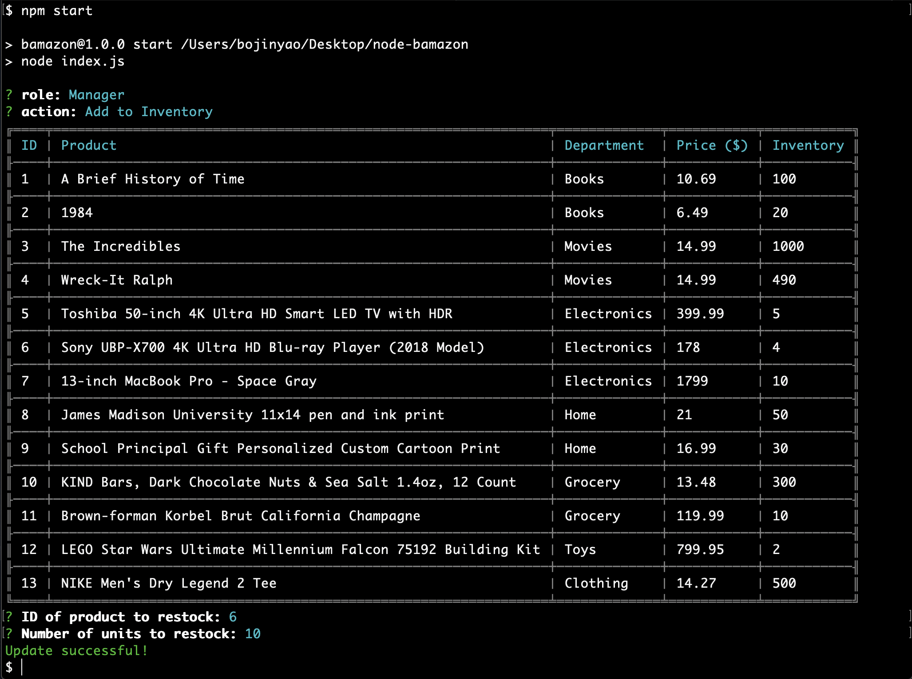
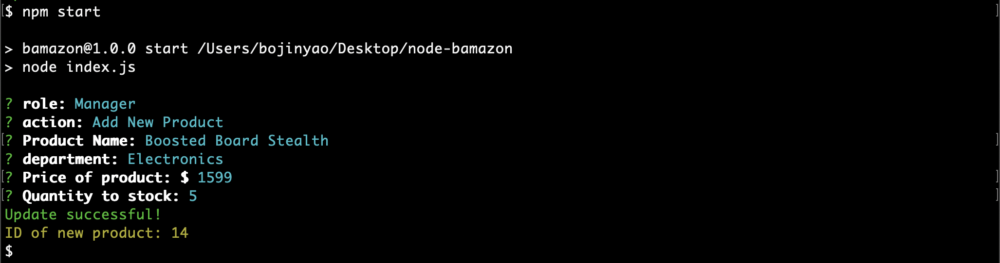

# **node-database**
A mock amazon app implemented in node using mysql as database. App supports three different types of users

* Customer
* Manager
* Supervisor

## Set Up - is as easy as 1,2,3
1. Run `npm install` first inside `node-bamazon` directory
2. Start a MySQL server, such as MAMP
3. Finally, in your terminal, type `npm start`

## Configuration
The first time running this app, a `.env` file will be created. To configure the app, either delete the file, or change corresponding fields inside the file. 

# What this app does:

## *As a Customer:*

You have the option to purchase items from existing inventory. 
  
Follow the prompt. After each purchase, you will be provided with total amount. If there is not enough inventory, an error message will appear.
 

## *As a Manager*

You have a number of options to choose from.
 
Options are:
1. View Products for Sale

2. View Low Inventory

3. Add to Inventory

4. Add New Product

## *As a Supervisor*

You have two options to choose from.
 

The option to add new departments is similar to adding new products as a manager.
 
Option 1 is more fun in that the system dynamically calculates profits of each department:

