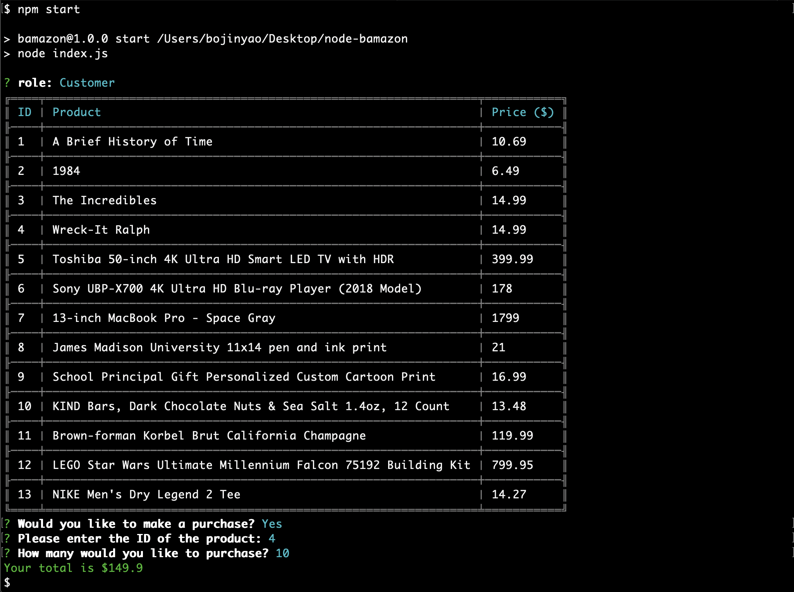

# **node-database**
A mock amazon app implemented in node using mysql as database. App supports three different types of users

* Customer
* Manager
* Supervisor

## Set Up - is as easy as 1,2,3
1. Run `npm install` first inside `node-database` directory
2. Start a MySQL server, such as MAMP([Free Download](https://www.mamp.info/en/))
3. Finally, in your terminal, type `npm start`. **Note: On first startup, you will be directed to configure the local server. If you're not familiar with a local database server, checkout [Configuration](#configuration) below.* 

## Configuration
**The first time running this app, a `.env` file will be created. To re-configure the app, either delete the file, or change corresponding fields inside the file.**
For Mamp users ([Free Download](https://www.mamp.info/en/)) follow below instruction for standard port configuration:
1. Launch Mamp by clicking on the app icon.
2. Click `Mamp` on menu bar, then `Preferences`
3. Go to `Ports`, then click `Set Web & MySQL ports to 80 & 3306` and your ports will be set to standard.
4. Click `OK`, once the `Preferences` window goes away, you can click `Start Servers` (you will need to type your computer password) to start your local database server.
   
To *skip* setting Mamp to standard ports do:
1. Launch Mamp by clicking on the app icon.
2. Click `Start Servers` (you will need to type your computer password) to start your local database server.
3. Wait, then Click `Open WebStart Page` and follow the web-link. The configuration you're interested in is:  **Shown above are standard ports*

On first start up (after you've run `npm install` and `npm start`) simply enter corresponding configurations when prompted:  **Note: you can create a new database(e.g. "trial") where some dummy data will be filled for you. To change target database, you should modify `.env` file directly!*
# What this app does:

## *As a Customer:*

You have the option to purchase items from existing inventory. 
  
Follow the prompt. After each purchase, you will be provided with total amount. If there is not enough inventory, an error message will appear.
 

## *As a Manager*

You have a number of options to choose from.
 
Options are:
1. View Products for Sale

2. View Low Inventory

3. Add to Inventory

4. Add New Product

## *As a Supervisor*

You have two options to choose from.
 

The option to add new departments is similar to adding new products as a manager.
 
Option 1 is more fun in that the system dynamically calculates profits of each department:

